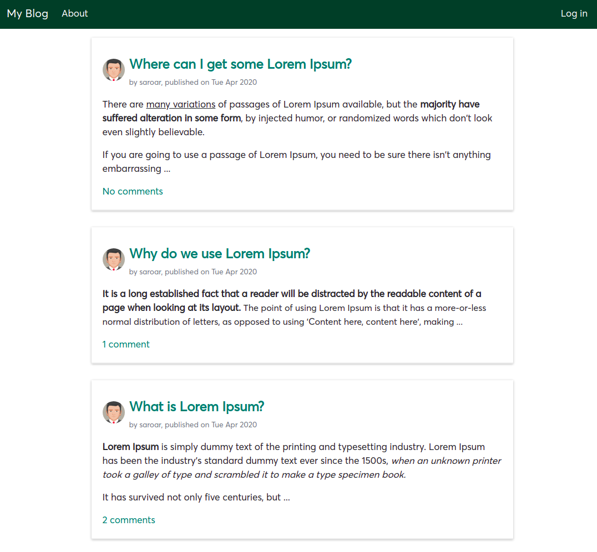

# Simple Django Blog

This is a simple blog made with Django 1.11 and Bootstrap 4.  

You need to be a [Superuser](https://djangocentral.com/creating-super-user-in-django/) to create an (admin) account. Only admins can create new posts. Anyone can read posts and comment on them, but comments appear on the site only after admin's approval.

Here is the live [demo](http://saroar.pythonanywhere.com).

### How do I get set up?
First, we need to create a virtual environment. I am assuming you have [Anaconda](https://www.anaconda.com/distribution/) installed on your computer. If you do not have Anaconda, you can create a virtualenv following [these instructions](https://docs.python.org/3/library/venv.html).  

Clone this repo:  
`git clone https://github.com/golamSaroar/django-blog.git`

Go to project directory:  
`cd /path/to/django-blog`

Create a virualenv:  
`conda create -n myenv python=3.6`

Activate virtualenv:  
`conda activate myenv`

Install Requirements:  
`pip install -r requirements.txt`

Database Migration:  
`python manage.py migrate`

Create Superuser:  
`python manage.py createsuperuser`

Run the project:  
`python manage.py runserver`

You can now access the blog at http://127.0.0.1:8000/  
Log in with the username and password you created in the previous step.
